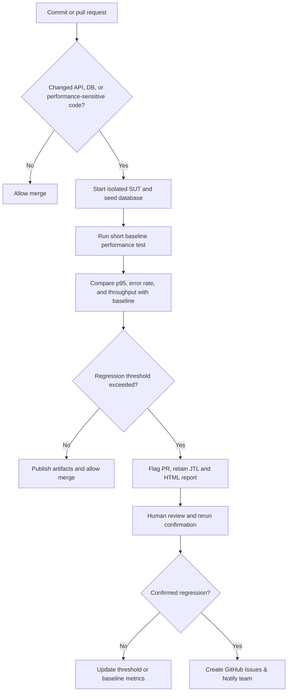

# HW05 - Performance Testing 

### THÔNG TIN SINH VIÊN

- **Họ và tên:** Lê Hữu Minh Quang
- **Mã số sinh viên:** 23127108
- **Lớp:** 23KTPM4
- **Repository GitHub:** https://github.com/fgounlimitedluckgame/HW05

# Báo cáo kiểm thử hiệu năng

---

## Task 1

### 1. Các kích bản được chọn

| Nhóm endpoint | Endpoint | Vai trò trong workflow |
|---|---|---|
| Auth-heavy | `POST /api/login` | Đăng nhập và lấy token xác thực |
| Read-heavy | `GET /api/products?search=...` | Tìm kiếm sản phẩm |
| Read-heavy | `POST /api/cart` | Thêm một sản phẩm vào giỏ hàng |
| Transactional | `POST /api/checkout` | Thanh toán đơn hàng |

### 2. Cấu hình test plan

| Scenario | File JMX | VUs | Ramp-up | Duration | Listener | Thinking time
|---|---|---|---|---|---|---|
| Load | `plans/23127108_Load_20260828.jmx` | 30 | 10 giây | 120 giây | Summary Report | 700-1500ms |
| Stress | `plans/23127108_Stress_20260828.jmx` | 100 | 60 giây | 120 giây | Aggregate Report | 700-1500ms |
| Spike | `plans/23127108_Spike_20260828.jmx` | 150 | 2 giây | 60 giây | View Results Tree | 500-1000ms |
| Endurance | `plans/23127108_Endurance_20260828.jmx` | 30 | 60 giây | 600 giây | Aggregate Report | 700-1500ms |

### 3. Cấu hình máy tính
| Hạng mục | Giá trị |
|---|---|
| OS | Windows 10 Pro 10.0, 64-bit |
| Máy | Dell Latitude 7430 |
| CPU | 12th Gen Intel(R) Core(TM) i7-1255U, ~1.7GHz |
| RAM | 16384MB ~ 16GB |

Thông tin chi tiết ở file [specs](specs.png)


### 3. Human review khi AI sinh test plan

#### Lỗi 1: Phát sinh jmx lỗi ở phần Summary View
Trong file `generate_jmx.js`, AI đã sử dụng listener xml như sau:
```javascript
<SummaryReport guiclass="SummaryReport" testclass="SummaryReport" testname="Summary Report" enabled="true">
          <boolProp name="ResultCollector.error_logging">false</boolProp>
          <objProp>
            <name>saveConfig</name>
            <value class="SampleSaveConfiguration">
              <time>true</time>
              <latency>true</latency>
              <timestamp>true</timestamp>
              <success>true</success>
              <label>true</label>
              <code>true</code>
              <message>true</message>
              <threadName>true</threadName>
              <dataType>true</dataType>
              <encoding>false</encoding>
              <assertions>true</assertions>
              <subresults>true</subresults>
              <responseData>false</responseData>
              <samplerData>false</samplerData>
              <xml>false</xml>
              <fieldNames>true</fieldNames>
              <responseHeaders>false</responseHeaders>
              <requestHeaders>false</requestHeaders>
              <responseDataOnError>false</responseDataOnError>
              <saveAssertionResultsFailureMessage>true</saveAssertionResultsFailureMessage>
              <assertionsResultsToSave>0</assertionsResultsToSave>
              <bytes>true</bytes>
              <sentBytes>true</sentBytes>
              <url>true</url>
              <threadCounts>true</threadCounts>
              <idleTime>true</idleTime>
              <connectTime>true</connectTime>
            </value>
          </objProp>
          <stringProp name="filename"></stringProp>
        </SummaryReport>
        <hashTree/>`;
```
- **Lí do sai:** Đây là xml listener không hợp lệ, khi cho vào JMeter thật thì JMeter sẽ báo lỗi
- **Nguyên nhân:** AI có thể đã sử dụng các xml listener lỗi thời, hoặc có thể do file xml có cấu trúc phức tạp khiến cho AI sinh ra một file `jmx` bị lỗi
- **Sửa lại:**
```javascript
<ResultCollector guiclass="SummaryReport" testclass="ResultCollector" testname="Summary Report">
          <boolProp name="ResultCollector.error_logging">false</boolProp>
          <objProp>
            <name>saveConfig</name>
            <value class="SampleSaveConfiguration">
              <time>true</time>
              <latency>true</latency>
              <timestamp>true</timestamp>
              <success>true</success>
              <label>true</label>
              <code>true</code>
              <message>true</message>
              <threadName>true</threadName>
              <dataType>true</dataType>
              <encoding>false</encoding>
              <assertions>true</assertions>
              <subresults>true</subresults>
              <responseData>false</responseData>
              <samplerData>false</samplerData>
              <xml>false</xml>
              <fieldNames>true</fieldNames>
              <responseHeaders>false</responseHeaders>
              <requestHeaders>false</requestHeaders>
              <responseDataOnError>false</responseDataOnError>
              <saveAssertionResultsFailureMessage>true</saveAssertionResultsFailureMessage>
              <assertionsResultsToSave>0</assertionsResultsToSave>
              <bytes>true</bytes>
              <sentBytes>true</sentBytes>
              <url>true</url>
              <threadCounts>true</threadCounts>
              <idleTime>true</idleTime>
              <connectTime>true</connectTime>
            </value>
          </objProp>
          <stringProp name="filename">23127108_load_20260826.jtl</stringProp>
        </ResultCollector>
        <hashTree/>
```
#### Lỗi 2: Cấu hình API search sai
AI ban đầu đã cho rằng ở API search thì từ khoá `search` chỉ cần thêm keyword, trong khi đặc tả ghi `/api/products?search=${keyword}`
- **Lí do sai:** API endpoint nhạy cảm ở tag `?`, nên việc dùng parameter ban đầu sẽ khiến cho endpoint không hoạt động
- **Nguyên nhân:** AI không đọc kĩ đặc tả API
- **Sửa lại:** Như đặc tả

#### Lỗi 3: Mô phỏng thinking time của load testing chưa sát với thực tế
AI ban đầu cho thinking time của load testing là 1000-2000 ms
- **Lí do sai:** 1000-2000ms mặc dù cũng là một thinking time ổn, nhưng nó không sát với một người hay lướt e-commerce
- **Nguyên nhân:** AI thường nghĩ theo hướng là giả lập hành vi của một người lướt trang e-commerce bình thường hơn là giả lập e-commerce thật
- **Sửa lại:** Sửa thinking time về 700-1500 ms

#### Lỗi 4: Sai response assertion cho checkout
AI ban đầu viết response để assert cho checkout là `Order created` và `Đã tạo đơn hàng`
- **Lí do sai:** Kết quả trả về là `Checkout successful`
- **Nguyên nhân:** AI chỉ sinh file jmx dựa trên đặc tả, trong khi đặc tả API không nêu rõ response trả về cụ thể là gì
- **Sửa lại:** Sửa response assertion thành `Checkout successful`

### 4. Kết quả chạy 

| Scenario | Samples | Duration quan sát | Throughput | Error rate | Average | Median | p90 | p95 | p99 | Min | Max |
|---|---:|---:|---:|---:|---:|---:|---:|---:|---:|---:|---:|
| Load | 3,098 | 118.68s s | 26.1 req/s | 0.000% | 8.38 ms | 5 ms | 23 ms | 25 ms | 28 ms | 0 ms | 153 ms |
| Stress | 8,101 | 119.28s | 67.92 req/s | 0.000% | 6.15 ms | 4 ms | 15 ms | 21 ms | 26 ms | 0 ms | 42 ms |
| Spike | 11,624 | 59.48 s | 195.44 req/s | 0.000% | 4.46 ms | 9 ms | 12 ms | 22 ms | 18 ms | 0 ms | 41 ms |
| Endurance | 15,455 | 599.19 s | 25.79 req/s | 0.000% | 8.05 ms | 5 ms | 23 ms | 24 ms | 26 ms | 0 ms | 44 ms |

**Ghi chú endurance testing:** NodeJS tiêu thụ 56.7 MB bộ nhớ và 1.6% CPU, không có hiện tượng bị rò rỉ dữ liệu

- Đánh giá: Hệ thống có ngưỡng chịu đựng tối đa là 25.79 req/s. Tại đây, hệ thống có error rate là 0% và có p99 ở mức 26ms và không có dấu hiệu suy thoái hiệu năng theo thời gian, đây là một kết quả khá tốt với một SUT (đặc biệt là với một trang e-commerce)

---

## Task 2

### 1. Kiểm tra kết luận của AI từ thông số có được

#### Misinterpretation #1 — AI kết luận rằng hệ thống tổng thể hoàn toàn chắc chắn khi nhìn vào 0% error rate
- **Vì sao sai:** Mặc dù 0% không sai về mặt thông số, nhưng dataset dùng để kiểm thử đã được đơn giản hoá khi toàn bộ dữ liệu đều có trong đặc tả và hoàn toàn hợp lệ, tức là đã bỏ qua một số điều như login bị lockout khi login sai 3 lần, hoặc search query không tồn tại.
- **Sủa lại:** Bỏ kết luận này

#### Misinterpretation #2 — AI kết luận rằng hệ thống chạy nhanh hơn khi bị spike
- AI nhìn vào p95 được aggregrate của load và spike lần lượt là 25ms và 12ms để kết luận rằng hệ thống chạy nhanh hơn khi spike
- **Vì sao sai:** Trong 1 thời gian test nhanh và thinking time rất ngắn (500-1000ms), JMeter đưa những response trong bộ nhớ vào hàng đợi, nhưng việc tính toán kết hợp lại tính trung bình của các mẫu không trọng số đồng thời, hơn là thể hiện server stress
- **Sửa lại:** Con số này chỉ là hệ quả của cấu hình thinking time và thời gian test, chứ không thể hiện được hệ thống chạy tốt hơn dưới tải cao


#### Misinterpretation #3 — AI cho rằng thời gian chạy 153ms của Login (phần Load Testing) là do query bị thiếu index
- AI cho rằng nguyên nhân của max response của login (153ms) là do query đang sử dụng full table scan `SELECT * FROM users WHERE email = ?`. 
- **Vì sao sai:** Mặc dù query này không có index, test data được dùng có lượng dữ liệu khá nhỏ (chỉ có 1 người dùng), nên query sẽ chạy rất nhanh. Còn việc response ban đầu là 153ms là do warmup I/O, V8 JIT, và libuv thread-pool initialization ở những request đầu. Điều này có thể được minh chứng từ việc average response time là 6.35ms
- **Sửa lại:** bỏ kết luận này

### 2. Kiểm tra đề xuất cải thiện hiệu năng của AI

#### Đề xuất 1: Sửa dụng SQLite WAL

**Đề xuất:** AI đề xuất thêm WAL và busy timeout như sau:
```javascript
  db.serialize(() => {
      db.run("PRAGMA journal_mode=WAL;");
      db.run("PRAGMA busy_timeout=5000;"); // Wait up to 5s instead of throwing SQLITE_BUSY immediately
  });
```
**Đánh giá:** Feasible
**Lí do:** Việc dùng WAL giúp thực hiện non-blocking read khi write đang được thực hiện, giảm thiểu `SQLITE_BUSY`

#### Đề xuất 2: Sử dụng prepared statements
**Đề xuất:** AI đề xuất sử dụng `db.prepare()` để giảm compliation overhead 
**Đánh giá:** Partially Feasible (rõ hơn: Không cần thiết trong trường hợp này)
**Lí do:** Tuy việc dùng `db.prepare` trong SQLite của C hay C++ có thể giúp giảm compliation overhead, `db.prepare()` của `sqlite3` của node.js được xử lý bất đồng bộ giúp giảm thiểu I/O throughput gain

#### Đề xuất 3: Sử dụng index ở các bảng users, orders, coupon_usage
**Đề xuất:** Thêm index vào `email` (users), `user_id` (orders), và một composite index gồm `coupon_id` và `user_id` (coupon_usage)
**Đánh giá:** Feasible
**Lí do:** Việc thêm index tăng tốc độ truy vấn ở các bảng cần đọc nhiều

---

## Task 3 

Mô hình Continuous Performance Testing được trình bày như sau:

### 3.1. Flow Chart


### 3.2. Mô tả quy trình
1. Nếu commit các file không liên quan tới API, DB, hoặc code ảnh hưởng tới hiệu năng, cho phép merge. Ngược lại, chuyển qua bước 2
2. Thực hiện test trên SUT được cô lập + seed database (khởi động môi trường kiểm thử)
3. Chạy performance test baseline ngắn
4. So sánh p95, error rate, throughput với baseline
5. Nếu không phát hiện regression, cho phép merge và kết thúc quy trình. Ngược lại, chuyển qua bước 6
6. Đánh dấu regression, giữ file JTL và HTML report
7. Con người rà soát và chạy regression lại
8. Nếu không phát hiện regression, cập nhật lại threshold và baseline metric, và kết thúc quy trình. Ngược lại, chuyển qua bước 9
9. Tạo Github issues và báo cáo với team

### 3.3. Phân tích trade-offs

| Yếu tố | Ưu điểm | Nhược điểm | Giải pháp giảm thiểu |
|--------|---------|------------|----------------------|
| **Cost** | Phát hiện regression sớm | Tốn thời gian CI | Chỉ chạy khi backend code thay đổi |
| **False Alarms** | Bắt được mọi regression | Nhiễu từ môi trường thực thi | Dùng threshold 20%; chạy 3 lần lấy median; loại outlier |
| **Coverage** | Test nhiều endpoint = an toàn hơn | Thời gian chạy tỷ lệ thuận với số endpoint | Ưu tiên critical endpoint |

### 3.4. Kết luận
Việc chạy Continuous Regression testing giúp ta phát hiện lỗi và sửa lỗi sớm, từ đó tạo ra sự tự tin khi deploy sản phẩm. Ngoài ra, nó có thể giúp ta tích luỹ baseline theo thời gian, từ đó có được góc nhìn về xu hướng hiệu năng của hệ thống

Trade-off Continuous Regression testing là việc chạy CI sẽ mất thời gian (có thể giảm thiểu được bằng cách thu hẹp phạm vi những artifact cần được kiểm thử), và yếu tố gây nhiễu từ môi trường test có thể ảnh hưởng đến đánh giá regression (có thể giảm thiểu bằng cách cấu hình lại tiêu chí test phù hợp)


